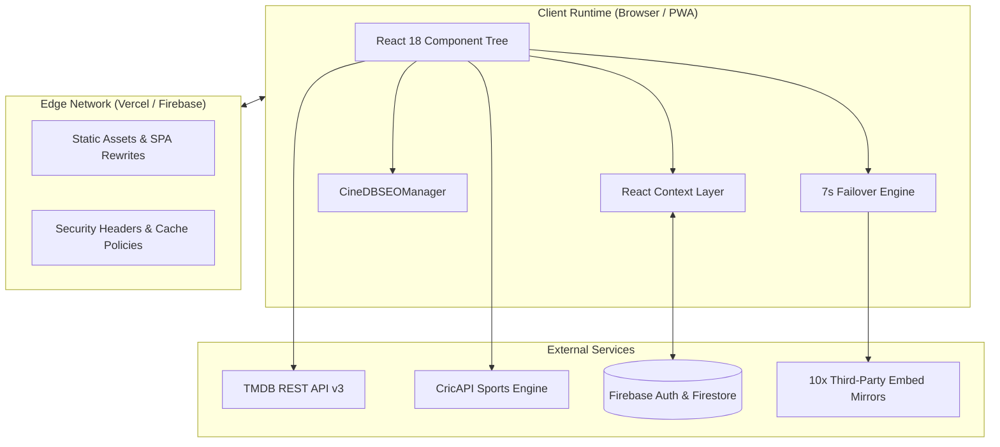
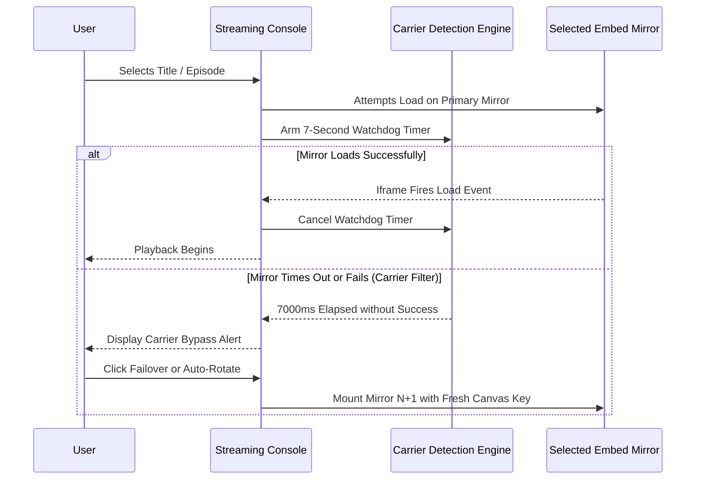

# 🏛️ CineDB — System Architecture & Technical Specifications

> **Author:** Makoju Suman Kumar  
> **Repository:** [CineDB.xyz](https://github.com/Msumankumar05/CineDB.xyz)  
> **Live Site:** [cinedb.xyz](https://www.cinedb.xyz)  
> **Last Updated:** October 2026  

---

## 📑 Table of Contents

1. [Architectural Overview](#1-architectural-overview)
2. [Component & Route Topology](#2-component--route-topology)
3. [State Management Layer](#3-state-management-layer)
4. [External API Integrations](#4-external-api-integrations)
5. [10-Tier Streaming Failover Engine](#5-10-tier-streaming-failover-engine)
6. [Cloud Firestore Data Model & Security](#6-cloud-firestore-data-model--security)
7. [Programmatic SEO Lifecycle](#7-programmatic-seo-lifecycle)
8. [Performance & Asset Pipeline](#8-performance--asset-pipeline)

---

## 1. Architectural Overview

CineDB is built as a modern, high-performance Single-Page Application (SPA) utilizing **React 18** and **Vite 5**. The application emphasizes speed, zero bloat, and maximum reliability across varying network conditions (including 4G/5G mobile carriers).



---

## 2. Component & Route Topology

Routing is governed by `react-router-dom` v6 with dynamic code-splitting via `React.lazy` and `Suspense`:

| Route Pattern | Target Component | Auth Policy | SEO Index Policy |
|---|---|---|---|
| `/` | `Home.jsx` | Public | `index, follow` (1.0) |
| `/movie/:id` | `MovieDetails.jsx` | Public | `index, follow` (0.8) |
| `/tv/:id`, `/series/:id` | `MovieDetails.jsx` | Public | `index, follow` (0.8) |
| `/person/:id` | `ActorDetails.jsx` | Public | `index, follow` (0.7) |
| `/category/:category` | `Category.jsx` | Public | `index, follow` (0.85) |
| `/category/genre` | `Category.jsx` | Public | `index, follow` (0.75) |
| `/cricket` | `Cricket.jsx` | Public | `index, follow` (0.9) |
| `/search` | `Search.jsx` | Public | `noindex, follow` |
| `/watch/:type/:id` | `Watch.jsx` | Public | `noindex, follow` |
| `/watchlist` | `Watchlist.jsx` | Protected (Verified) | `noindex, follow` |
| `/profile` | `Profile.jsx` | Protected (Verified) | `noindex, follow` |
| `/login`, `/register` | `Auth/*.jsx` | Guest Only | `noindex, follow` |
| `/terms`, `/privacy`, `/contact` | Static Pages | Public | `index, follow` (0.7) |

---

## 3. State Management Layer

State is partitioned into modular React Contexts, preventing unnecessary re-renders across the component tree:

- **`AuthContext`:** Tracks Firebase User instance, JWT session validity, and `emailVerified` status.
- **`WatchlistContext`:** Manages real-time Firestore listeners (`onSnapshot`) for the user's active watchlist. Provides optimistic UI updates for instant interaction response.
- **`ReviewsContext`:** Handles community review CRUD interactions with Firestore collections.
- **`ThemeContext`:** Manages system preference auto-detection (`prefers-color-scheme`), manual user toggle, and persistence in `localStorage`.
- **`ToastContext`:** Global non-blocking notification queue for system messages, error alerts, and operation confirmations.

---

## 4. External API Integrations

### The Movie Database (TMDB API v3)
- **Base Endpoint:** `https://api.themoviedb.org/3`
- **Catalog Ingestion:** Trending endpoints (`/trending/movie/week`, `/trending/tv/week`), Discover queries with language codes (`te`, `hi`, `ta`, `ml`), watch providers, credits, and YouTube trailers.
- **Image Pipeline:** Dynamic CDN sizing (`w342`, `w500`, `w780`, `original`) via `https://image.tmdb.org/t/p`.

### CricAPI (Live Sports & Cricket Engine)
- **Live Matches:** Polls `/cricScore` and `/matches` for real-time live match scores, team status, and ball counts.
- **Cadence:** 30-second background polling cycle while on the `/cricket` route.

---

## 5. 10-Tier Streaming Failover Engine

CineDB integrates a resilient, prioritized 10-mirror embed matrix for media streaming. Many carrier networks (especially mobile 5G/LTE) throttle or block particular streaming embeds; CineDB solves this with automated rotation:



### Prioritized Server Array
1. **Server 1 (AutoEmbed HD)** — High-bandwidth primary embed
2. **Server 2 (2Embed)** — Clean fallback server with subtitle pass-through
3. **Server 3 (SuperEmbed)** — High-res multi-audio source
4. **Server 4 (VidSrc)** — Low-latency redundant mirror
5. **Server 5 (SmashyStream)** — Alternate source with adaptive bitrate
6. **Servers 6–10 (Mirrors 6–10)** — Secondary failover endpoints for specialized regions and ISP compatibility

---

## 6. Cloud Firestore Data Model & Security

### Document Schema
```
users/{userId}
  ├── profileData: { displayName, email, createdAt, lastLogin }
  ├── watchlist/{mediaId}: {
  │     mediaId, title, poster_path, backdrop_path,
  │     media_type, vote_average, release_date, addedAt
  │   }
  ├── history/{mediaId}: {
  │     mediaId, title, poster_path, media_type,
  │     season, episode, lastWatchedAt
  │   }
  └── reviews/{mediaId}: {
        mediaId, title, rating, reviewText, updatedAt
      }
```

### Security Rules Strategy
All Firestore operations are protected by granular rules ensuring user data can only be accessed or modified by its authenticated owner:
```javascript
rules_version = '2';
service cloud.firestore {
  match /databases/{database}/documents {
    match /users/{userId}/{document=**} {
      allow read, write: if request.auth != null && request.auth.uid == userId;
    }
  }
}
```

---

## 7. Programmatic SEO Lifecycle

Because CineDB is an SPA, metadata is managed programmatically via `CineDBSEOManager` (`src/utils/seo.js`):

1. **Title & Meta Description:** Reactive updates on route transition with automatic truncation at 160 characters.
2. **Open Graph & Twitter Cards:** Injects high-resolution TMDB backdrop/poster URLs into `og:image` and `twitter:image`.
3. **Canonical URLs:** Strict mapping to `https://www.cinedb.xyz` to prevent non-www and duplicate-content indexing penalties.
4. **Structured Data Injection (JSON-LD):**
   - **Homepage:** `WebSite` with Google Sitelinks Searchbox (`SearchAction`) + `Organization`.
   - **Movie:** `Movie` schema with `AggregateRating`, `director`, `actor`, `duration`, and `genre`.
   - **TV Series:** `TVSeries` schema with `numberOfSeasons`, `numberOfEpisodes`, and ratings.
   - **Person:** `Person` schema with `jobTitle`, `filmography`, and bio.
   - **Cricket:** `SportsEvent` schema with live status.

---

## 8. Performance & Asset Pipeline

- **Bundle Optimization:** `vite.config.js` specifies granular chunk groups (`vendor-react`, `vendor-firebase`, `vendor-misc`).
- **Font Optimization:** Google Fonts (`Inter` and `Outfit`) preconnected with `crossorigin`.
- **Edge Cache Directives:** Static assets configured with `public, max-age=31536000, immutable` in `vercel.json` and `firebase.json`.

---

<div align="center">
  <p><strong>CineDB Architecture Documentation © 2026 Makoju Suman Kumar</strong></p>
</div>
