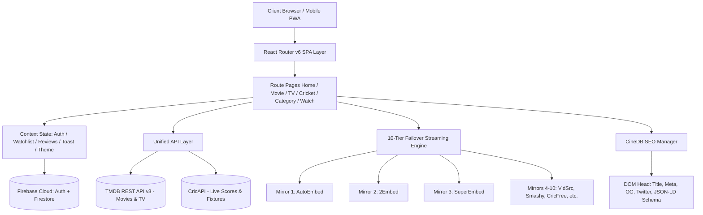

<div align="center">


# 🎬 CineDB — The Modern Cinematic Universe

<p align="center">
  <strong>An ultra-fast, high-fidelity entertainment discovery engine & streaming companion built with React 18, Vite 5, TMDB v3 API, and Firebase.</strong>
</p>

<p align="center">
  <a href="https://www.cinedb.xyz"></a>
  <a href="https://www.cinedb.xyz"></a>
  <a href="https://vitejs.dev/"></a>
  <a href="https://react.dev/"></a>
  <a href="https://firebase.google.com/"></a>
  <a href="https://developer.themoviedb.org/"></a>
</p>

<p align="center">
  <a href="https://www.cinedb.xyz"><strong>🌐 Launch CineDB Live (cinedb.xyz)</strong></a>
  &nbsp;&nbsp;•&nbsp;&nbsp;
  <a href="https://itsmsk.vercel.app/"><strong>👤 Developer Portfolio</strong></a>
  &nbsp;&nbsp;•&nbsp;&nbsp;
  <a href="mailto:ms.kumar.developer05@gmail.com"><strong>📫 Get in Touch</strong></a>
  &nbsp;&nbsp;•&nbsp;&nbsp;
  <a href="#-system-architecture"><strong>📐 Architecture</strong></a>
</p>

<br />

> *"Track what you love, discover what’s next, obsess over filmographies, and stream across multiple failover mirrors — all within an OLED-optimized, glassmorphic UI."*

</div>

---

## 📑 Table of Contents

- [Executive Summary](#-executive-summary)
- [Key Highlights & New Features](#-key-highlights--new-features)
- [System Architecture](#-system-architecture)
- [Detailed Feature Breakdown](#-detailed-feature-breakdown)
  - [1. Real-Time Global Search & Filter Engine](#1-real-time-global-search--filter-engine)
  - [2. Indian Cinema Taxonomy (Regional Hubs)](#2-indian-cinema-taxonomy-regional-hubs)
  - [3. High-Fidelity 3-Tab Recommendation Engine](#3-high-fidelity-3-tab-recommendation-engine)
  - [4. Pro 10-Tier Failover Mirror Stream Console](#4-pro-10-tier-failover-mirror-stream-console)
  - [5. Real-Time Cricket Scores & Live Sports Hub](#5-real-time-cricket-scores--live-sports-hub)
  - [6. Cloud-Synced Watchlist & "Recently Watched" Shelf](#6-cloud-synced-watchlist--recently-watched-shelf)
  - [7. Community Review Engine & 5-Star Distribution](#7-community-review-engine--5-star-distribution)
  - [8. Complete Actor & Talent Profiles](#8-complete-actor--talent-profiles)
  - [9. Enterprise Multi-Provider Authentication](#9-enterprise-multi-provider-authentication)
  - [10. Programmatic Enterprise SEO & Rich Schemas](#10-programmatic-enterprise-seo--rich-schemas)
- [Tech Stack & Engineering Standards](#-tech-stack--engineering-standards)
- [Performance & Core Web Vitals](#-performance--core-web-vitals)
- [Security, Isolation & Privacy](#-security-isolation--privacy)
- [Project Directory Layout](#-project-directory-layout)
- [Local Setup & Deployment](#-local-setup--deployment)
- [Roadmap & Milestones](#-roadmap--milestones)
- [Developer & Copyright](#-developer--copyright)

---

## 🌟 Executive Summary

**CineDB** is a production-grade, full-stack cinematic exploration platform engineered to deliver an uncompromising media discovery and playback experience. Built from the ground up without heavy external UI component kits, CineDB pairs bespoke Vanilla CSS glassmorphism with high-speed React 18 patterns, granular code splitting, and reactive state management.

Whether exploring global box office hits, filtering Telugu or Hindi regional cinema, streaming with automatic carrier-bypass mirrors, checking live international cricket scores ball-by-ball, or curating personal watchlists with device sync, CineDB serves as the ultimate media command center.

---

## 🚀 Key Highlights & New Features

| Highlight | Description |
|---|---|
| 🇮🇳 **Indian Cinema Taxonomy** | Dedicated hubs for **Telugu (Tollywood)**, **Hindi (Bollywood)**, **Tamil (Kollywood)**, and **Malayalam (Mollywood)** with language-first catalog aggregation. |
| ⚡ **3-Tab Recommendation Engine** | Next-gen recommendation shelf offering **Similar Titles**, **Genre-Matched Gems**, and **Cast/Crew Crossover Filmography** options. |
| 📺 **10-Tier Failover Mirror Engine** | Automated carrier-block detection with 7-second auto-rotation across 10 high-speed third-party embed servers. |
| 🏏 **Live Cricket Scores & Streams** | Real-time score ticker, live ball-by-ball metrics via CricAPI, upcoming match calendar, and sports stream mirrors. |
| 👁️ **"Recently Watched" Shelf** | Firestore-backed continuous playback memory allowing users to pick up movies and TV series where they left off. |
| 🚀 **Programmatic Enterprise SEO** | Google Sitelinks Searchbox (`SearchAction`), Movie/TVSeries/Person/SportsEvent `Schema.org` JSON-LD, and automated dynamic XML sitemaps. |
| 🔐 **Google OAuth & Strict Auth** | One-tap Google authentication, mandatory email verification, and client-side credential persistence. |
| 🌓 **OLED Midnight Dark Theme** | Ultra-deep dark mode designed for high-contrast mobile displays with seamless light mode fallback. |

---

## 📐 System Architecture

### High-Level Data Flow



---

## 🔍 Detailed Feature Breakdown

### 1. Real-Time Global Search & Filter Engine
- **Instant Debounced Queries:** Search across tens of millions of movies, TV series, directors, and actors with 300ms debounce.
- **Multifaceted Filters:** Filter results by media category, release year, genre tag, and minimum user rating.
- **Auto-Suggest Dropdown:** Quick-launch search previews without leaving the active screen.

### 2. Indian Cinema Taxonomy (Regional Hubs)
- **Tollywood (Telugu - తెలుగు):** Dedicated landing page curating trending Telugu blockbusters, classics, and regional web series.
- **Bollywood (Hindi - हिंदी):** Discover nationwide theatrical releases, Hindi dubbed hits, and popular OTT series.
- **Kollywood (Tamil - தமிழ்):** Full catalog of Tamil action, romance, and acclaimed indie cinema.
- **Mollywood (Malayalam - മലയാളം):** Deep-dive into contemporary Malayalam cinema and critically acclaimed dramas.
- **Pan-Indian Multilingual Browse:** Filter by multi-language queries (`hi|te|ta|ml|kn`) in one combined collection.

### 3. High-Fidelity 3-Tab Recommendation Engine
Replaces legacy flat recommendation strips with a deep, context-aware 3-tab layout:
- **Tab 1: Similar Titles** — TMDB algorithmic recommendations based on audience viewing patterns and themes.
- **Tab 2: Genre Matches** — Curated titles sharing primary and secondary genre taxonomy tags.
- **Tab 3: Cast & Director Crossover** — Highlights top-rated movies and series starring the lead cast or directed by the same filmmaker.

### 4. Pro 10-Tier Failover Mirror Stream Console
- **10 Selectable Mirrors:** Includes prioritized embed sources designed for speed, minimal buffering, and stability.
- **Automated Carrier-Bypass Rotation:** If a player mirror times out or is blocked by an ISP/carrier filter, an automated 7-second failover engine prompts the user or swaps mirrors seamlessly.
- **Dynamic Episode Selectors:** Season and episode dropdowns with instant playback resumption and pop-out canvas mode.

### 5. Real-Time Cricket Scores & Live Sports Hub
- **Live Match Ticker:** Real-time scoreboard with team scores, wickets, overs, and inning status.
- **Auto-Refresh Engine:** Scores poll every 30 seconds in the background without layout shifts.
- **Upcoming Fixtures:** Comprehensive schedule of upcoming bilateral series, ICC tournaments, and league fixtures.
- **Live Sports Stream Aggregator:** 4 embedded mirror feeds for cricket and global sports events.

### 6. Cloud-Synced Watchlist & "Recently Watched" Shelf
- **Firebase Firestore Persistence:** Instant synchronization across desktop, tablet, and mobile devices when logged in.
- **"Recently Watched" Row:** Automatically tracks viewed titles and remembers the exact TV season and episode watched.
- **Instant Toggles:** One-click add/remove buttons with optimistic UI updates and toast feedback.

### 7. Community Review Engine & 5-Star Distribution
- **Verified Reviews:** Only registered and email-verified users can publish title reviews.
- **Star Rating System:** 1 to 5 star ratings with live average calculation and user distribution bar charts.
- **Full CRUD Support:** Users can create, edit, or delete their submitted reviews at any time.

### 8. Complete Actor & Talent Profiles
- **Biographical Data:** Date of birth, birthplace, known-for department, and biography summary.
- **Filmography Grid:** Comprehensive timeline of acting and crew credits sorted chronologically.
- **Direct Navigation:** Seamless jumps between actors, movies, and TV series.

### 9. Enterprise Multi-Provider Authentication
- **Google OAuth:** One-click social login via Google Identity.
- **Email & Password Authentication:** Client-side validation with real-time feedback.
- **Mandatory Email Verification:** Protects against bot sign-ups before allowing reviews or watchlist mutations.
- **Account Deletion (GDPR Compliance):** Complete, permanent wipe of user account and associated Firestore documents.

### 10. Programmatic Enterprise SEO & Rich Schemas
- **Google Sitelinks Searchbox:** Standard `WebSite` schema with `potentialAction` (`SearchAction`) template.
- **Organization Knowledge Graph:** Brand metadata, logo URL, founder info, and social profiles.
- **Rich Media Schemas:** `Movie`, `TVSeries`, `Person`, and `SportsEvent` with `AggregateRating`, `director`, `actor`, and `duration`.
- **Crawl Budget Directives:** High-efficiency `robots.txt` disallowing private user paths and preventing crawler budget waste.
- **Dynamic Image Sitemap:** `sitemap.xml` automatically outputs Google Image XML tags (`<image:loc>`, `<image:title>`) for all posters.

---

## 💻 Tech Stack & Engineering Standards

```
Frontend:
  ├── Core:          React 18.3.1 (Strict Mode)
  ├── Build Tool:    Vite 5.4.21 (Fast ESM, Code-Splitting, PostCSS)
  ├── Routing:       React Router DOM v6.22 (Lazy Suspense, Scroll Restoration)
  ├── Styling:       Pure CSS3 (Modular BEM-like classes, CSS Custom Properties)
  └── HTTP Client:   Axios (Interceptors, Configurable Timeouts)

Cloud & Backend:
  ├── Auth:          Firebase Authentication (Google OAuth + Email/Password)
  ├── Database:      Cloud Firestore (Fine-Grained Security Rules)
  ├── Hosting:       Vercel Edge Network + Firebase Hosting
  └── Data APIs:     The Movie Database (TMDB v3) + CricAPI
```

---

## ⚡ Performance & Core Web Vitals

- **Code Splitting & Lazy Loading:** All 14 route pages are lazy-loaded via `React.lazy()` and `Suspense`, keeping initial JS bundle size minimal.
- **Resource Preconnects & DNS Prefetching:** Preconnects established for `fonts.googleapis.com`, `fonts.gstatic.com`, `image.tmdb.org`, and `api.themoviedb.org`.
- **Responsive TMDB Image Resolution:** Loads `w342` / `w500` images for cards and lists, reserving `w780` / `original` for desktop hero viewports.
- **Immutable Cache Headers:** Configured via `vercel.json` and `firebase.json` for all compiled static assets (`public, max-age=31536000, immutable`).

---

## 🔒 Security, Isolation & Privacy

1. **Sandboxed Player Frames:** Third-party video player iframes execute with strict permissions (`allow-scripts allow-same-origin allow-fullscreen allow-forms`).
2. **Firestore Granular Rules:** Strict security rules enforce that users can only read and write their own watchlist records:
   ```javascript
   match /users/{userId}/watchlist/{movieId} {
     allow read, write: if request.auth != null && request.auth.uid == userId;
   }
   ```
3. **Zero Tracking Commitment:** No tracking scripts, no behavioral ad networks, and no data broker telemetry.

---

## 📂 Project Directory Layout

```
CineDB/
├── public/
│   ├── cinedb.png              # Primary brand asset (512x512)
│   ├── robots.txt              # Crawl budget optimization & directives
│   └── sitemap.xml             # XML Sitemap with Google Image namespace
├── scripts/
│   └── generate-sitemap.js     # Dynamic catalog & sitemap compiler
├── src/
│   ├── api/
│   │   ├── auth.js             # Firebase auth wrappers & social login
│   │   ├── tmdb.js             # TMDB REST endpoints & queries
│   │   └── cricket.js          # CricAPI live scores & fixtures
│   ├── components/
│   │   ├── Navbar.jsx          # Desktop & tablet header with search & theme
│   │   ├── Footer.jsx          # Brand links, legal disclaimers, socials
│   │   ├── MobileBottomNav.jsx # Native-feel mobile navigation bar
│   │   ├── MovieCard.jsx       # Poster card with hover effects & ratings
│   │   ├── Recommendations/    # 3-Tab recommendation architecture
│   │   ├── Reviews/            # Rating distribution & review forms
│   │   └── streaming/          # 10-mirror streaming console & episode picker
│   ├── context/
│   │   ├── AuthContext.jsx     # User session & email verification state
│   │   ├── WatchlistContext.jsx# Firestore watchlist synchronization
│   │   ├── ReviewsContext.jsx  # Community review state
│   │   ├── ThemeContext.jsx    # OLED Dark / Light mode toggle
│   │   └── ToastContext.jsx    # System notifications
│   ├── pages/
│   │   ├── Home.jsx            # Hero carousel, trending strips, shelves
│   │   ├── MovieDetails.jsx    # Full movie page, cast, trailers, reviews
│   │   ├── Watch.jsx           # Stream console with failover controls
│   │   ├── Category.jsx        # Genre and regional cinema taxonomies
│   │   ├── Cricket.jsx         # Live cricket hub, scores & sports streams
│   │   ├── Search.jsx          # Instant search results with facets
│   │   ├── ActorDetails.jsx    # Filmography & biography breakdown
│   │   ├── Watchlist.jsx       # User watchlist management
│   │   ├── Profile.jsx         # User account settings & statistics
│   │   └── Auth/               # Login, Register, Forgot Password
│   ├── styles/                 # Pure CSS3 styles & theme variables
│   └── utils/
│       ├── constants.js        # Categories, genres, languages, mirrors
│       └── seo.js              # CineDBSEOManager programmatic SEO engine
├── firestore.rules             # Cloud Firestore security policy
├── vercel.json                 # Headers, cache policies, and SPA rewrites
└── vite.config.js              # Vite build setup with chunk splitting
```

---

## 🛠️ Local Setup & Deployment

### Prerequisites
- **Node.js:** v18.0.0 or higher
- **NPM:** v9.0.0 or higher
- **TMDB API Key:** Available at [themoviedb.org](https://developer.themoviedb.org/docs/getting-started)
- **Firebase Project:** With Authentication and Firestore enabled

### Installation

```bash
# 1. Clone the repository
git clone https://github.com/Msumankumar05/CineDB.git
cd CineDB

# 2. Install dependencies
npm install

# 3. Configure environment variables
cp .env.example .env
```

Add your keys to `.env`:
```env
VITE_TMDB_API_KEY=your_tmdb_api_key_here
VITE_FIREBASE_API_KEY=your_firebase_api_key
VITE_FIREBASE_AUTH_DOMAIN=your_project.firebaseapp.com
VITE_FIREBASE_PROJECT_ID=your_project_id
VITE_CRICAPI_KEY=your_optional_cricapi_key
```

### Development & Production

```bash
# Start local dev server
npm run dev

# Compile production bundle and generate sitemap
npm run build

# Preview production build locally
npm run preview
```

---

## 🗺️ Roadmap & Milestones

- [x] **Google OAuth Login** — Seamless single-click authentication
- [x] **Live Cricket Scores & Streaming** — Real-time CricAPI integration
- [x] **10-Tier Failover Mirror Stream Console** — Carrier-bypass player rotation
- [x] **Indian Cinema Taxonomy** — Telugu, Hindi, Tamil, Malayalam hubs
- [x] **High-Fidelity 3-Tab Recommendations** — Deep context-aware suggestions
- [x] **Enterprise Programmatic SEO** — Sitelinks searchbox, JSON-LD Schemas, Image sitemaps
- [x] **Recently Watched Shelf** — Firestore-backed continuous playback
- [ ] **GitHub OAuth Provider** — Developer-friendly login alternative
- [ ] **Public Watchlist Sharing** — Unique shareable URLs for community lists
- [ ] **Push Notifications** — Alerts when new episodes drop for followed series
- [ ] **Progressive Web App (PWA)** — Offline shell with installable manifest

---

## 📬 Developer & Copyright

**Built with passion by Makoju Suman Kumar**  
*Full-Stack Engineer & Designer*

- 🌐 **Portfolio:** [itsmsk.vercel.app](https://itsmsk.vercel.app/)
- 🐙 **GitHub:** [@Msumankumar05](https://github.com/Msumankumar05)
- 💼 **LinkedIn:** [in/itsmskdev](https://www.linkedin.com/in/itsmskdev/)
- ✉️ **Email:** [ms.kumar.developer05@gmail.com](mailto:ms.kumar.developer05@gmail.com)

---

### ⚖️ Copyright Notice

**Copyright © 2026 Makoju Suman Kumar. All rights reserved.**

*This showcase repository and its documentation are provided publicly for viewing, evaluation, and portfolio assessment purposes. The source code, UI designs, and original architectures are proprietary. Movie metadata and imagery are provided courtesy of [The Movie Database (TMDB)](https://www.themoviedb.org/). CineDB does not host, upload, or control third-party video stream streams.*

<br />

<div align="center">
  <a href="https://www.cinedb.xyz">
    
  </a>
</div>
