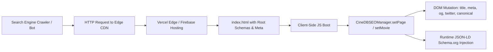

# 🎯 CineDB — Programmatic SEO & Search Engineering Strategy

> **Author:** Makoju Suman Kumar  
> **Domain:** [https://www.cinedb.xyz](https://www.cinedb.xyz)  
> **Technical Stack:** Vite + React SPA, Runtime Head Injection, Googlebot JavaScript Indexing  

---

## 📑 Strategy Overview

Single-Page Applications (SPAs) frequently struggle with search engine optimization due to client-side rendering. CineDB solves this with a **zero-dependency, programmatic SEO engine** (`CineDBSEOManager`) coupled with server edge routing, structured data injection, and automated image sitemaps.



---

## 1. Document Head & Primary Metadata

### Baseline Meta Tokens
All pages inherit high-authority baseline meta tags defined in `index.html`:
- **Canonical Domain:** `https://www.cinedb.xyz/` (prevents link equity dilution from preview deployments or non-www hostnames).
- **Robots Directive:** `index, follow` globally, with targeted `noindex, follow` on faceted search queries, authenticated routes, and embed players.
- **Resource Hints:**
  - `preconnect` to `https://image.tmdb.org` and `https://fonts.gstatic.com`
  - `dns-prefetch` to `https://api.themoviedb.org` and `https://img.youtube.com`

---

## 2. Structured Data (JSON-LD) Implementations

### A. WebSite Schema with Sitelinks Searchbox (`SearchAction`)
Enables Google Search to render an integrated search bar directly below CineDB SERP listings:

```json
{
  "@context": "https://schema.org",
  "@graph": [
    {
      "@type": "WebSite",
      "@id": "https://www.cinedb.xyz/#website",
      "url": "https://www.cinedb.xyz/",
      "name": "CineDB",
      "description": "Your personal cinematic universe — track, discover, and obsess over films & TV series.",
      "potentialAction": {
        "@type": "SearchAction",
        "target": {
          "@type": "EntryPoint",
          "urlTemplate": "https://www.cinedb.xyz/search?q={search_term_string}"
        },
        "query-input": "required name=search_term_string"
      }
    },
    {
      "@type": "Organization",
      "@id": "https://www.cinedb.xyz/#organization",
      "name": "CineDB",
      "url": "https://www.cinedb.xyz/",
      "logo": "https://www.cinedb.xyz/cinedb.png",
      "founder": {
        "@type": "Person",
        "name": "Makoju Suman Kumar",
        "url": "https://itsmsk.vercel.app/"
      }
    }
  ]
}
```

### B. Movie Rich Snippet Schema
Generated dynamically in `MovieDetails.jsx` for every movie entity:

```json
{
  "@context": "https://schema.org",
  "@type": "Movie",
  "name": "Inception",
  "url": "https://www.cinedb.xyz/movie/27205",
  "image": "https://image.tmdb.org/t/p/w500/oYuLEt3zVCKq57qu2F8dT7NIa6f.jpg",
  "datePublished": "2010-07-15",
  "description": "Cobb, a skilled thief who steals corporate secrets through dream-sharing technology...",
  "duration": "PT2H28M",
  "genre": ["Action", "Science Fiction", "Adventure"],
  "aggregateRating": {
    "@type": "AggregateRating",
    "ratingValue": 8.4,
    "bestRating": "10",
    "worstRating": "1",
    "ratingCount": 35210
  },
  "director": {
    "@type": "Person",
    "name": "Christopher Nolan",
    "url": "https://www.cinedb.xyz/person/525"
  },
  "actor": [
    {
      "@type": "Person",
      "name": "Leonardo DiCaprio",
      "url": "https://www.cinedb.xyz/person/6193"
    }
  ]
}
```

### C. TV Series Schema
Includes `numberOfSeasons`, `numberOfEpisodes`, and series rating aggregation.

### D. Live Sports Schema (`SportsEvent`)
Injected on the `/cricket` route with match descriptions, organizer metadata, and real-time event status.

---

## 3. Social Graph Protocol (Open Graph & Twitter Cards)

Every screen mutates Open Graph and Twitter Card tags to ensure link previews render flawlessly on Discord, Slack, WhatsApp, Twitter/X, and Telegram:

| Open Graph Property | Content Format | Example |
|---|---|---|
| `og:title` | `<Entity> (<Year>) - <Type> \| CineDB` | `Inception (2010) - Movie \| CineDB` |
| `og:description` | Curated synopsis capped at 160 chars | Plot summary + genre hints |
| `og:image` | TMDB `w780` backdrop (fallback to poster) | `https://image.tmdb.org/t/p/w780/...jpg` |
| `og:image:alt` | Descriptive image alt tag | `Inception poster and backdrop - CineDB` |
| `og:type` | `video.movie`, `video.tv_show`, or `website` | `video.movie` |
| `twitter:card` | `summary_large_image` | High-impact card format |
| `twitter:site` | `@itsmskdev` | Developer handle attribution |

---

## 4. Automated Google Image XML Sitemap Pipeline

Located in `scripts/generate-sitemap.js`, this Node.js script executes post-build:
1. Queries TMDB catalog endpoints (`/trending/movie/week`, `/movie/popular`, `/trending/tv/week`, `/tv/popular`).
2. Deduplicates entity IDs.
3. Generates standard `<loc>`, `<lastmod>`, `<changefreq>`, and `<priority>` nodes.
4. Appends **Google Image XML tags** (`<image:image><image:loc>...</image:loc><image:title>...</image:title></image:image>`) for all posters.
5. Injects all static routes, regional categories (`/category/telugu`, `/category/hindi`, etc.), and live sports hubs (`/cricket`).

---

## 5. Crawl Budget & Index Directive Strategy

### `robots.txt` Policy
```
User-agent: *
Allow: /
Allow: /movie/
Allow: /tv/
Allow: /series/
Allow: /person/
Allow: /category/
Allow: /cricket
Allow: /terms
Allow: /privacy
Allow: /contact

Disallow: /watchlist
Disallow: /profile
Disallow: /login
Disallow: /register
Disallow: /forgot-password
Disallow: /verify-email
Disallow: /watch/
Disallow: /search?*

Sitemap: https://www.cinedb.xyz/sitemap.xml
Host: https://www.cinedb.xyz
```

### HTTP Response Headers (`X-Robots-Tag`)
Configured in `vercel.json` and `firebase.json`:
- Authenticated and query routes return `X-Robots-Tag: noindex, follow`.
- Static assets return `Cache-Control: public, max-age=31536000, immutable` for peak Core Web Vitals.

---

<div align="center">
  <p><strong>CineDB SEO Engineering Strategy © 2026 Makoju Suman Kumar</strong></p>
</div>
